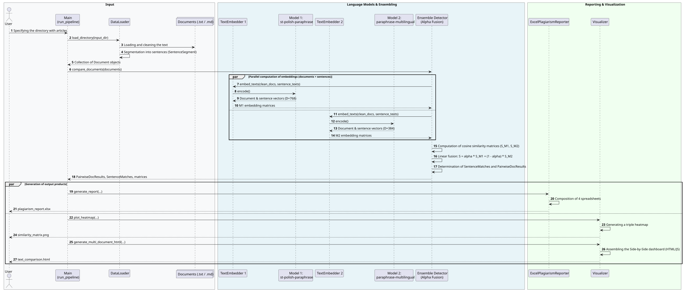
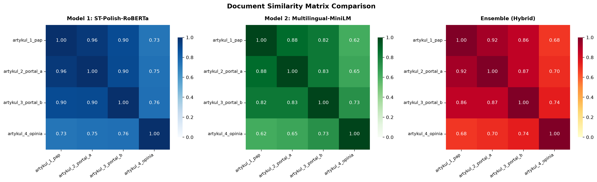

#+TITLE: Plagiarism Detection System with Language Model Fusion (NLP Ensemble)
#+AUTHOR: Michał Janiga
#+OPTIONS: toc:2

* Project Description

The project implements a comprehensive environment for detecting borrowings, verbatim copies, and paraphrases across any number of text documents.

* Solution Architecture

The following diagram presents the data flow and the architecture of the language model fusion in the detector pipeline.

#+begin_src plantuml :file docs/architecture.svg :exports results
@startuml
autonumber

box "Input" #F8F9FA
actor "User" as User
participant "Main\n(run_pipeline)" as Main
participant "DataLoader" as DL
collections "Documents (.txt / .md)" as Docs
end box

box "Language Models & Ensembling" #E8F4F8
participant "TextEmbedder 1" as E1
participant "Model 1:\nst-polish-paraphrase" as M1
participant "TextEmbedder 2" as E2
participant "Model 2:\nparaphrase-multilingual" as M2
participant "Ensemble Detector\n(Alpha Fusion)" as Ensemble
end box

box "Reporting & Visualization" #F0FFF0
participant "ExcelPlagiarismReporter" as Reporter
participant "Visualizer" as Vis
end box

User -> Main: Specifying the directory with articles
Main -> DL: load_directory(input_dir)
DL -> Docs: Loading and cleaning the text
DL -> DL: Segmentation into sentences (SentenceSegment)
DL --> Main: Collection of Document objects

Main -> Ensemble: compare_documents(documents)

par Parallel computation of embeddings (documents + sentences)
    Ensemble -> E1: embed_texts(clean_docs, sentence_texts)
    E1 -> M1: encode()
    M1 --> E1: Document & sentence vectors (D=768)
    E1 --> Ensemble: M1 embedding matrices
else
    Ensemble -> E2: embed_texts(clean_docs, sentence_texts)
    E2 -> M2: encode()
    M2 --> E2: Document & sentence vectors (D=384)
    E2 --> Ensemble: M2 embedding matrices
end

Ensemble -> Ensemble: Computation of cosine similarity matrices (S_M1, S_M2)
Ensemble -> Ensemble: Linear fusion: S = alpha * S_M1 + (1 - alpha) * S_M2
Ensemble -> Ensemble: Determination of SentenceMatches and PairwiseDocResults
Ensemble --> Main: PairwiseDocResults, SentenceMatches, matrices

par Generation of output products
    Main -> Reporter: generate_report(...)
    Reporter -> Reporter: Composition of 4 spreadsheets
    Reporter --> User: plagiarism_report.xlsx
else
    Main -> Vis: plot_heatmap(...)
    Vis -> Vis: Generating a triple heatmap
    Vis --> User: similarity_matrix.png
    Main -> Vis: generate_multi_document_html(...)
    Vis -> Vis: Assembling the Side-by-Side dashboard (HTML/JS)
    Vis --> User: text_comparison.html
end
@enduml
#+end_src

#+RESULTS:

* 1. Fulfillment of Project Requirements

1. *Ability to compare any number of files:*
   - Loading files from a directory (~DataLoader.load_directory~), automatic segmentation into sentences, relational comparison of document pairs and sentence fragments.
2. *Summary in the form of an Excel spreadsheet (~.xlsx~):*
   - Sheet 1: *Pair Summary* (scoring table, risk assessment, text coverage).
   - Sheet 2: *Similarity Matrices* (interactive heatmaps with gradient coloring in Excel for Model 1, Model 2, and Ensemble).
   - Sheet 3: *Detected Fragments* (a listing of borrowed sentences with exact metrics for each model).
   - Sheet 4: *Model Evaluation* (a compilation of statistics, discrepancies, and conclusions from the fusion).
3. *Comparison of 2 language models and investigation of their combination:*
   - *Model 1:* ~sdadas/st-polish-paraphrase-from-distilroberta~ – a model fine-tuned specifically for detecting Polish paraphrases.
   - *Model 2:* ~sentence-transformers/paraphrase-multilingual-MiniLM-L12-v2~ – an optimized multilingual bi-encoder model.
   - *Ensemble (Combination):* Linear vector fusion \(S_{ensemble} = \alpha \cdot S_{M1} + (1 - \alpha) \cdot S_{M2}\). The fusion eliminates /False Positive/ errors resulting from purely thematic convergence as well as /False Negative/ errors in the case of rare vocabulary and proper names.
4. *Visualizations of similarities between 2–4 texts simultaneously:*
   - A static triple correlation matrix (~similarity_matrix.png~).
   - An interactive Side-by-Side dashboard (~text_comparison.html~) enabling simultaneous viewing of up to 4 articles, with synchronous highlighting of related fragments after clicking any sentence.
5. *Test on real press articles:*
   - In the ~data/test_articles/~ directory, 4 press articles from the same day on the same topic were prepared (an agreement with the European Space Agency regarding a Polish mission to the ISS):
     - ~artykul_1_pap.txt~ – the source dispatch (PAP).
     - ~artykul_2_portal_a.txt~ – an article from a news portal (a paraphrase of the dispatch with copied quotes).
     - ~artykul_3_portal_b.txt~ – a business article (partial paraphrase + unique economic fragments).
     - ~artykul_4_opinia.txt~ – an independent opinion column on the same topic (a common topic, but no lexical-paraphrase borrowings).

* 2. Installation and Environment Management (uv)

The project uses the ~uv~ package and environment manager and the ~pyproject.toml~ standard.

Requirements: Python >= 3.14 and ~uv~ installed.

** Virtual environment synchronization:

#+begin_src text
uv sync --all-groups
#+end_src

Alternatively, using the traditional ~pip~:

#+begin_src text
python -m venv .venv
source .venv/bin/activate
pip install -e ".[dev]"
#+end_src

* 3. Running the Pipeline

Running the full analysis process for the default set of press articles:

#+begin_src text
uv run plagiarism-detector
#+end_src

Optional command-line arguments:

#+begin_src text
uv run plagiarism-detector --input-dir data/test_articles --output-dir reports --alpha 0.55 --threshold 0.72
#+end_src

** CLI Parameters:
- ~--input-dir~, ~-i~: Folder with ~.txt~ or ~.md~ files to compare (default ~data/test_articles~).
- ~--output-dir~, ~-o~: Target directory for reports and charts (default ~reports~).
- ~--alpha~, ~-a~: Weight assigned to Model 1 in the ensemble fusion (value from 0.0 to 1.0, default ~0.55~).
- ~--threshold~, ~-t~: Minimum threshold of semantic similarity of sentences considered a borrowing/paraphrase (default ~0.72~).

* 4. Analysis Results

All generated artifacts go to the ~reports/~ directory:
1. ~plagiarism_report.xlsx~ – a 4-sheet spreadsheet with formatted tables, gradients, and a detailed analysis of borrowings.
2. ~similarity_matrix.png~ – a triple heatmap comparing Model 1, Model 2, and Ensemble.
3. ~text_comparison.html~ – an interactive browser application presenting articles in a Side-by-Side layout with dynamic highlighting of matching sentences.

* 5. Running Tests

The project contains a set of unit tests examining tokenization, Polish abbreviation rules, vector normalization, and ensemble fusion algebra:

#+begin_src text
uv run pytest
#+end_src

* 6. Similarity Heatmap

The figure below presents the triple heatmap generated by the pipeline
(~reports/similarity_matrix.png~). It compares the cosine similarity
matrices of Model 1, Model 2, and the ensemble fusion for every pair of
documents, making it easy to spot where the two models agree and where
the fusion corrects their individual biases.

#+CAPTION: Cosine similarity matrices for Model 1, Model 2, and the Ensemble
#+NAME: fig:similarity-matrix

* Disclaimer

The sample texts used in this project were generated with the assistance
of a large language model (LLM) solely for the purpose of demonstrating
the plagiarism detection pipeline. They do not reproduce, quote, or
paraphrase any real publication, press dispatch, or third-party work.
Any resemblance to actual events, organisations, or persons is
coincidental and serves only to illustrate how the detector behaves on
realistic input.

The generated artifacts in the ~reports/~ directory (including
~text_comparison.html~) are derived exclusively from these synthetic
sample texts and may therefore be freely published together with the
source code.
